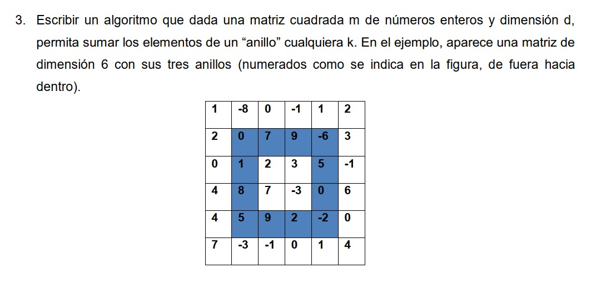

# EXPLICACION DEL ALGORITMO
## algoritmo usado en lenguaje java:
```java
import java.util.Random;
import java.util.Scanner;

public class main {

    public static void main(String[] args) {
        Random rrr = new Random();
        Scanner leer = new Scanner(System.in);
        System.out.println("INGRESE LA DIMENSION");
        int d = leer.nextInt();
        int m[][] = new int[d][d];
        for (int i = 0; i < m.length; i++) {
            for (int j = 0; j < m[0].length; j++) {
                m[i][j] = rrr.nextInt(101);
            }
        }

        for (int i = 0; i < m.length; i++) {
            for (int j = 0; j < m[0].length; j++) {
                System.out.print("[" + m[i][j] + "]  ");
            }
            System.out.println("");
        }

        System.out.println("INGRESE ANILLO A SUMAR");
        int k = leer.nextInt();
        int axi1 = k - 1;
        int axi2 = d - k;
        int suma = 0;

        for (int i = k - 1; i <= d - k; i++) {
            suma += m[axi1][i];
            suma += m[axi2][i];
            suma += m[i][axi1];
            suma += m[i][axi2];
        }
        suma -= m[axi1][axi1];
        suma -= m[axi1][axi2];
        suma -= m[axi2][axi1];
        suma -= m[axi2][axi2];
        
        if (d % 2 != 0 && k == (d / 2) + 1) {
            int centro = d / 2;
            suma = m[centro][centro];
        }

        System.out.println("la suma del anillo " + k + " es de " + suma);
    }
}
```
## se uso este algoritmo para resolver el ejercio dado:


## explicacion del algoritmo paso por paso:
### Importaciones usadas:
```java
import java.util.Random;//<---primera
import java.util.Scanner;//<---segunda
```
- La **primera** permite generar textos random (de manera aleatoria).   
- Y la **segunda** se usa para leer la entrada de datos del usuario.

### creacion de objetos:
```java
Random rrr = new Random();
Scanner leer = new Scanner(System.in);
```
En esta parte se crean **objetos** con las importaciones llamadas anteriormente, **rrr** para el objeto ramdon y **leer** para el objeto Scanner.

### creacion de la matriz:
```java
        System.out.println("INGRESE LA DIMENSION");
        int d = leer.nextInt();//<---primera
        int m[][] = new int[d][d];//<---segunda
        for (int i = 0; i < m.length; i++) {//<---tercera
            for (int j = 0; j < m[0].length; j++) {
                m[i][j] = rrr.nextInt(101);//<---cuarta
            }
        }
```
- En la **primera** parte se pide la dimension de la matriz con el **objeto** leer.
- En la **segunda** parte creamos una matriz bidimensional de tipo int con dimensiones d*d.
- En la **tercera** parte en referencia a todo lo que cubre el for se llena de numeros int ramdon en cada fila y columna, para esto se usa un doble for el primero con variable i se usa para moverse por filas y el de variable j para las columnas, hambas terminan cuando alcansan el valor de la dimencion d.
- En la **cuarta** parte se crea un numero random int de 0 a 100 para el llenado de la matriz con el **objeto** rrr, el numero ramdon creado se copia en la matriz en la fila y columna en la que esta asta que terminen los ciclos for.

### imprimir la matriz:
```java
         for (int i = 0; i < m.length; i++) {
            for (int j = 0; j < m[0].length; j++) {
                System.out.print("[" + m[i][j] + "]  ");
            }
            System.out.print("");
        }
```
con un doble for que llamaremos i, j respectivamente el primero usado para la fila y el segundo para la columna, usando "System.out.print()" se muestra por terminal el numero en la matriz en la fila y columna respectiva, se usa un "System.out.println();" para el salto de linea que funcionaria como un salto de fila.

### imprimir la matriz:
```java
        System.out.println("INGRESE ANILLO A SUMAR");
        int k = leer.nextInt();
        int axi1 = k - 1;
        int axi2 = d - k;
        int suma = 0;
```
solicitamos al usuario el anillo a sumar y lo guardamos en k,creamos variables auxiliares para el inicio y fin del anillo k. La variable suma se inicializa en 0.

## Sumatoria de un anillo: 
```java
        for (int i = k - 1; i <= d - k; i++) {//<---primera
            suma += m[axi1][i];
            suma += m[axi2][i];
            suma += m[i][axi1];
            suma += m[i][axi2];
        }
        suma -= m[axi1][axi1];//<---segunda
        suma -= m[axi1][axi2];
        suma -= m[axi2][axi1];
        suma -= m[axi2][axi2];
```
- En la **primera** parte se suma el anillo, se suma las filas y columnas añadiendo cada numero a la variable suma.
- En la **segunda** parte se restan las esquinas ya que por la forma en la que se realiza las sumatorias las esquinas se suman doble.
## en caso del anillo de un digito:
```java
        if (d % 2 != 0 && k == (d / 2) + 1) {
            int centro = d / 2;
            suma = m[centro][centro];
        }
```
Esta parte del código maneja un caso especial que ocurre cuando la dimensión de la matriz (d) es impar y el usuario selecciona el anillo más interno de la matriz.
1. d % 2 != 0: Comprueba si la dimensión de la matriz (d) es impar.
Cuando d es impar, la matriz tiene un único elemento en el centro.
2. k == (d / 2) + 1: Verifica si el anillo solicitado (k) es el anillo más interno.
## imprimir el resultado 
```java
 System.out.println("la suma del anillo " + k + " es de " + suma);
```
Usando un System.out.println(); para mostrar en el terminal la variable suma (el resultado de la suma del anillo).

# COMPLEJIDAD DE ALGORITMO 
## Tiempo:
```java
import java.util.Random;
import java.util.Scanner;

public class main {

    public static void main(String[] args) {
        Random rrr = new Random();
        Scanner leer = new Scanner(System.in);
        System.out.println("INGRESE LA DIMENSION");
        int d = leer.nextInt();
        int m[][] = new int[d][d];
//O(n^2)
        for (int i = 0; i < m.length; i++) {
            for (int j = 0; j < m[0].length; j++) {
                m[i][j] = rrr.nextInt(101);
            }
        }
//O(n^2)
        for (int i = 0; i < m.length; i++) {
            for (int j = 0; j < m[0].length; j++) {
                System.out.print("[" + m[i][j] + "]  ");
            }
            System.out.println("");
        }
//0
        System.out.println("INGRESE ANILLO A SUMAR");
        int k = leer.nextInt();
        int axi1 = k - 1;
        int axi2 = d - k;
        int suma = 0;
//O(n)
        for (int i = k - 1; i <= d - k; i++) {
            suma += m[axi1][i];
            suma += m[axi2][i];
            suma += m[i][axi1];
            suma += m[i][axi2];
        }
//O(1)
        suma -= m[axi1][axi1];
        suma -= m[axi1][axi2];
        suma -= m[axi2][axi1];
        suma -= m[axi2][axi2];
//accion
        if (d % 2 != 0 && k == (d / 2) + 1) {
            int centro = d / 2;
            suma = m[centro][centro];
        }

        System.out.println("la suma del anillo " + k + " es de " + suma);
    }
}
```
Este nos daria una complejida   
O(n^2)+O(n^2)+O(n)+O(1) = O(2n^2+n+1)   
que en notacion big-O seria:   
**O(n^2)**
## Espacio:
- Una matriz de tamaño n*n, que ocupa O(n^2) espacio.
- Variables auxiliares (axi1, axi2, suma, etc.), que ocupan espacio constante O(1).
Este nos daria una complejida   
O(n^2)+O(1)+O(1)+O(1)=O(n^2+1)
que en notacion big-O seria:   
**O(n^2)**
# EL MEJOR Y EL PEOR CASO
